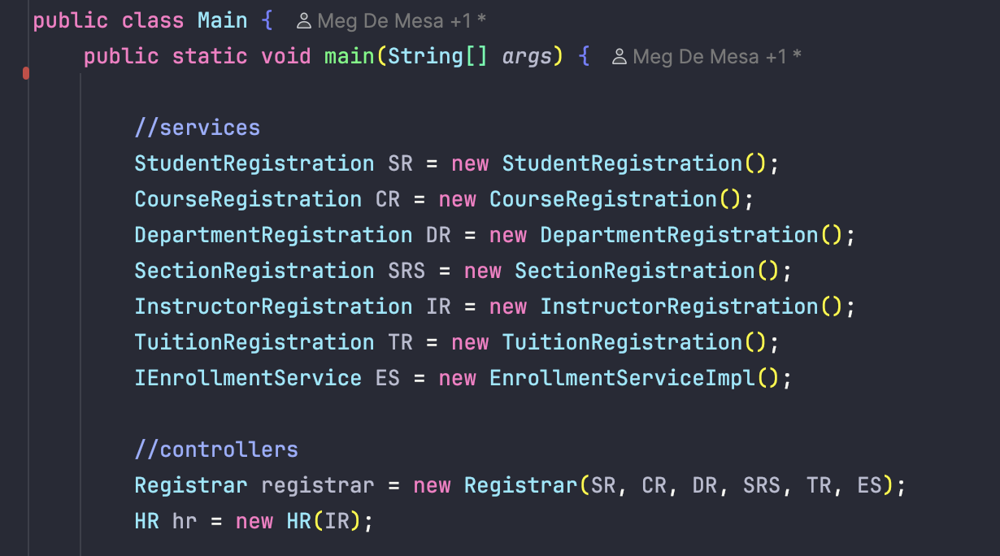

# Java OOP Enrollment System
**Author:** Meg De Mesa  
**Course:** Integrative Programming - Object-Oriented Programming (Finals)

---

## Project Overview
This is a comprehensive, console-based Enrollment System designed with a **Service-Oriented Architecture**. 
The system handles complex relationships between Departments, Courses, Sections, Instructors, and Students while 
maintaining high data integrity and robust business logic with separation of concerns.

### Key Features
* **Multi-Level Institutional Hierarchy:** Visualizes a real-world academic structure: `Department -> Section -> Instructor -> Enrolled Students`.
* **Dynamic Tuition Management:** Automatically calculates tuition fees based on course units and manages real-time payment processing with status tracking (ex., `FULLY PAID`).
* **Reference-Based Persistence:** Implements advanced object referencing, ensuring that student updates (like name changes) reflect instantly across all enrolled sections.
* **Smart Validation:** * **Capacity Guard:** Prevents enrollment in sections that have reached their maximum student limit.
    * **Duplicate Prevention:** Blocks the registration of duplicate Student or Instructor IDs.
    * **Input Protection:** Utilizes `Try-Catch` blocks to handle invalid user inputs (e.g., entering text into numeric fields) without crashing.

---
## Recommended Execution Flow
To experience the system’s full functionality and object-linking logic, please follow this sequence in the 
**Campus Portal**:

### **Step 1: Setup Foundation (Registrar Portal)**
1.  **[Option 10] Create Department:** Start by creating a department (ex. "CITE").
2.  **[Option 11] Create Course:** Add a course (ex. "CS101", "Java Programming", 3 units).
3.  **[Option 1] Save Student:** Register a few students to the database.

### **Step 2: Human Resources (HR Portal)**
1.  **[Option 1] Hire Instructor:** Create an instructor. The system will prompt you to link them to a Course 
created in Step 1.

### **Step 3: Object Linking (Registrar Portal)**
1.  **[Option 5] Create Section:** Name the section (ex. "IT1A") and select the **Department, Course, and Instructor** 
you created. This "glues" the entities together.
2.  **[Option 6] Enroll Student:** Now that a section is properly linked, you can enroll students. This will 
automatically trigger tuition calculation.

### **Step 4: Verification & Logic Testing**
1.  **[Option 9] Display Hierarchy:** View the institutional tree to confirm all relationships are correctly mapped.
2.  **[Option 7/8] Finance Logic:** Check student balances and process payments to test the business math.
---

## Strengths & Bonus Features (Phase 1, 2 & 4)

### 1. Decoupled Interface-Driven Design (separation of concerns)
The system strictly follows the requirement of separating data from logic. Every operation is defined in an 
**Interface** (e.g., `IEnrollmentService`, `IStudentService`) and implemented in concrete classes, allowing for 
high modularity and clean code.

### 2. Service-Oriented Logic
* **Registrar & HR Controllers:** Act as the main orchestration layer for coordinating multiple services.
* **TuitionRegistration:** Dedicated service for financial calculations, credit handling, and status updates.
* **EnrollmentServiceImpl:** Manages the complex tree structure and depth-first traversal for hierarchy viewing.

### 3. Advanced Input Validation (Bonus Feature)
To avoid crashing while the program runs, the system is fortified with `Try-Catch` blocks. This prevents 
"Input Mismatch" crashes (ex. a user entering a string where a number is expected). The system catches these 
exceptions, clears the scanner buffer, and prompts the user to try again, ensuring a professional and "crash-proof" 
user experience.

### 4. Dynamic Object Reference Persistence (Bonus Logic)
The system demonstrates a deep understanding of memory management. By using object references instead of static 
strings, any update made to a student (like name change or program shift) or a course (ex. unit revision) updates 
**globally and instantly** across all departments, sections, and hierarchy views without requiring manual 
synchronization.

### 5. Git Mastery & Professional Workflow
The project follows professional version control standards, including:
* **Conventional Commits:** Clear, structured commit messages tracking feature development and bug fixes.
* **Branching Strategy:** Systematic development of features through organized Git history, proving a high level of 
* technical discipline.

---

## Quality Assurance (JUnit 5)
To ensure the reliability of the business logic, the following **Automated Unit Tests** were implemented using the 
**AAA (Arrange, Act, Assert)** pattern. This proves the system meets the "Robust Business Logic" criteria.

1.  **Capacity Test:** Verifies that students are rejected when a section is full.
2.  **Duplicate ID Test:** Ensures data integrity by blocking identical Student IDs.
3.  **Tuition Math Test:** Validates unit-to-fee calculations and discount logic.
4.  **Payment Logic Test:** Confirms balances update correctly and handle overpayments (credits).
5.  **Instructor Assignment:** Proves that section objects correctly update their assigned personnel.

> ****
> **Test:** Capacity Rule
> Verifies that students are rejected when a section has reached its maximum capacity.

> ****
> **Test:** CRUD Consistency;
> Ensures that if you change a course's units in the registration service, the object itself is updated.

> ** **
> **Test:** tests the assignment logic;
> proves that when you assign a teacher, the Section actually hears it

> ** **
> **Test:** tests data integrity; 
> ensures one can't have two students with the same ID; 
> ensures student is saved correctly; 
> ensure the removal logic is done right

> ** **
> **Test:** proves the logic handles scenarios where a student pays more than they owe

---

## Progress Screenshots
*The following screenshots represent the developmental journey and core OOP concepts applied throughout the semester.*

## **Encapsulation**

## **Inheritance**

**Instructor Class**

**Student Class**

**Course Class**

**CourseRegistration Class**

**StudentRegistration Class**

## **Abstraction**
Person Class

Instructor Class

Student Class

## **Interface**
Student Registration interface

Course Registration interface
_

## **Polymorphism**
The Registrar interacts with the IEnrollmentService interface, allowing the system to use any implementation of that
service without changing the Registrar's code
